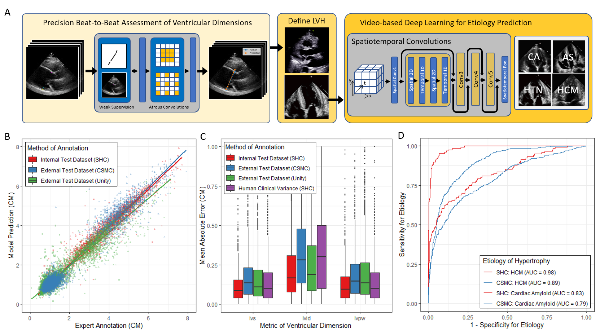

# EchoNet-LVH

EchoNet-LVH is a deep learning workflow that automatically quantifies ventricular hypertrophy with precision equal to human experts and predicts etiology of LVH.  




## Importance
Early detection and characterization of increased left ventricular (LV) wall thickness can significantly impact patient care but is limited by under-recognition of hypertrophy, measurement error and variability, and difficulty differentiating etiologies of increased wall thickness, such has hypertrophy cardiomyopathy and cardiac amyloidosis. 
## Objective
To overcome this challenge, we present a deep learning workflow that automatically quantifies ventricular hypertrophy with precision equal to human experts and predicts etiology of increased wall thickness. 
## Design, Settings, and Participants
Trained and tested on retrospectively obtained independent echocardiogram videos from Stanford Healthcare, Cedars-Sinai Medical Center (CSMC), and the Unity Imaging Collaborative. 
## Results
Our deep learning algorithm accurately measures intraventricular wall thickness (mean absolute error [MAE] 1.4mm, 95% CI 1.2-1.5mm), left ventricular diameter (MAE 2.4mm, 95% CI 2.2-2.6mm), and posterior wall thickness (MAE 1.2mm, 95% CI 1.1-1.3mm) and classifies cardiac amyloidosis (area under the curve of 0.83) and hypertrophic cardiomyopathy (AUC 0.98) from other etiologies of left ventricular hypertrophy. In external datasets from independent domestic and international healthcare systems, our deep learning algorithm accurately quantified ventricular parameters (R2 of 0.96 and 0.90 respectively, with MAE of 1.7mm for intraventricular septum (IVS) thickness, 3.8mm for left ventricular internal dimension (LVID), and 1.8mm for left ventricular posterior wall (LVPW) for the domestic healthcare system and MAE of 1.6mm for IVS, 3.6mm for LVID, and 2.1 mm for LVPW for the international healthcare system) and detected cardiac amyloidosis (AUC 0.79) and hypertrophic cardiomyopathy (AUC 0.89) on the domestic external validation site.
## Conclusions and Relevance
Leveraging measurements across multiple heart beats, our model can more accurately identify subtle changes in LV geometry and its causal etiologies. Compared to human experts, our deep learning workflow is fully automated, allowing for reproducible, precise measurements, and lays the foundation for precision diagnosis of cardiac hypertrophy. As a resource to promote further innovation, we also make publicly available a large dataset of 12,000 annotated echocardiogram videos.


<!-- ## Preprocessing -->

## Inference

### PLAX Wall Thickness Evaluation

Running inference for the PLAX hypertrophy model is possible with ```run_plax_inference.py``` using a simple CLI. The script searches a directory for .avi videos, runs inference on them and outputs results to an output directory. For example, if we have the file structure:

```
PLAX
|-> Videos
| |-> echo1_plax.avi
| |-> echo2_plax.avi
| |-> echo3_plax.avi
```

to run PLAX measurement inference, run

```
python run_plax_inference.py ./PLAX ./Inference
```

For each .avi found in the input directory, a folder with the same name as the file will be created in the output directory. Three files will be created and outputted to this directory: an .avi animation showing the model predictions overlayed on top of the original video. A .csv file with the frame-by-frame predictions, and a .png graph showing the measurements over time. The resulting file structure will be:

```
./
|-> PLAX
| |-> echo1_plax.avi
| |-> echo2_plax.avi
| |-> echo3_plax.avi
|-> Inference
| |-> echo1_plax
| | |-> echo1_plax.avi
| | |-> echo1_plax.csv
| | |-> echo1_plax.png
|-> Inference
| |-> echo2_plax
| | |-> echo2_plax.avi
| | |-> echo2_plax.csv
| | |-> echo2_plax.png
|-> Inference
| |-> echo3_plax
| | |-> echo3_plax.avi
| | |-> echo3_plax.csv
| | |-> echo3_plax.png
```

### A4C Disease Classification

Running binary video classification on A4C view echos is done in a similar fashion. ```run_classification_inference.py``` also expects an input directory and an output directory. The script will search the input directory for .avi videos, run inference on them, and output results to the output directory. Unlike the PLAX script, all inferences for the entire input directory will be saved in a single .csv file. For example if the original file structure is

```
./
|->A4C
| |-> echo1_a4c.avi
| |-> echo2_a4c.avi
| |-> echo3_a4c.avi
```

after running

```bash
python run_classification_inference.py ./A4C ./Inference
```

the resulting file structure will look like

```
./
|->A4C
| |-> echo1_a4c.avi
| |-> echo2_a4c.avi
| |-> echo3_a4c.avi
|->Inference
| |-> A4C.csv
```

For both PLAX and Classification, there are additional parameters that can be configured in the CLI. These can be found via the ```--help``` option.
